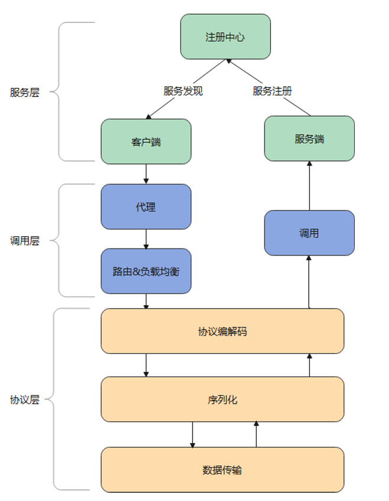
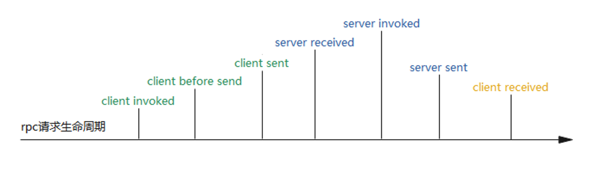

# simple-rpc
简易rpc框架

## Architecture
本项目基于主要分三层: 服务层, 调用层, 协议层

服务层主要负责服务集群的维护, 服务启动时会向注册中心写入服务信息, 客户端调用时会查询这些信息, 获取可用服务列表

调用层主要负责rpc请求的发起, 通过JDK动态代理, 获取服务列表, 经过路由和负载均衡后交由协议层进行传输, 提供同步和异步2种调用方式

协议层主要负责服务之间的通讯, 基于Netty自定义了一个rpc协议, 实现了协议的编解码, 经序列化后由Netty进行数据传输

架构图如下:


## Features

- 高可扩展性: 实现了扩展点机制(参考了Dubbo的SPI), 可以方便的替换框架每一层的实现, 包括服务注册, 路由策略, 负载均衡算法, 容错策略等。 用户只需实现对应接口, 
  然后在/META-INF/extensions下配置实现类的路径便可替换框架的默认实现
    
- 过滤器: 在请求生命周期的各个阶段都可以插入过滤器，添加业务逻辑。过滤器基于上述的扩展点机制，并额外提供注解扫包，无需配置文件



- 容错机制: 基于上述生命周期的client received过滤器, 捕获服务端异常后按照配置的策略实现容错, 配合扩展点机制, 用户可以便携的自定义容错策略
  
  |  策略    |  描述                                          |
  |  ----    | ----                                          |
  | failfast | 快速失败, 直接抛出异常                                         |
  | failover | 重试, 在路由后的服务列表中随机抽取另一个服务进行重试                                         |
  | failmock | 服务降级, 调用本地降级接口  
  | ...      | ... |


## Getting started
默认的注册中心是zookeeper, 如果没有需先安装
```docker
docker pull zookeeper:3.5.8
docker run -d --name zookeeper -p 2181:2181 zookeeper:3.5.8
```
拉取代码
```shell
git clone git@github.com:Meredith0/simple-rpc.git
```
提供了demo-server和demo-client, 实现了HelloWorld的rpc调用, 方便用户探索